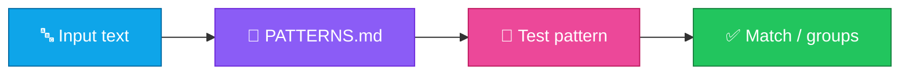

<p align="center">
  
</p>

<h1 align="center">regex-cheatsheet</h1>

<p align="center">
  <strong>EN</strong> Common regex patterns and examples<br/>
  <strong>PT</strong> Padrões regex comuns e exemplos
</p>

<p align="center">
  <a href="https://github.com/manansbdb/regex-cheatsheet/blob/main/LICENSE"></a>
  
  
  <a href="#support--apoio"></a>
</p>

---

## What it does / Para que serve

| English | Português |
|---------|-----------|
| A practical **regex patterns** cheatsheet with everyday examples. | Uma cheatsheet prática de **padrões regex** com exemplos do dia a dia. |
| Browse `PATTERNS.md` when validating emails, URLs, IDs, and more. | Consulta `PATTERNS.md` ao validar emails, URLs, IDs e mais. |



---

## Install / Instalação

### 1) Clone / Clona

```bash
git clone https://github.com/manansbdb/regex-cheatsheet.git
cd regex-cheatsheet
```

### 2) Copy / Copia

```bash
mkdir -p docs
cp PATTERNS.md docs/regex-patterns.md
```

### Requirements / Requisitos

- `git`
- No runtime dependencies

---

## Quick start / Início rápido

```bash
git clone https://github.com/manansbdb/regex-cheatsheet.git
# open PATTERNS.md and adapt examples to your language
```

---

## Contents / Conteúdos

| Path | Purpose / Função |
|------|------------------|
| `PATTERNS.md` | Patterns + examples |
| `SUPPORT.md` | Donations / Doações |

---

## Project layout / Estrutura

```text
regex-cheatsheet/
├── docs/banner.svg
├── PATTERNS.md
├── SUPPORT.md
└── README.md
```

---

## Support / Apoio

Bitcoin donations welcome / Doações em Bitcoin bem-vindas:

```
bc1q0qfnlnxyum9u45stzxe0a7jnhtj4j0usfkqdjw
```

See [SUPPORT.md](./SUPPORT.md).

---

## License / Licença

[MIT](./LICENSE) © 2026 manansbdb
